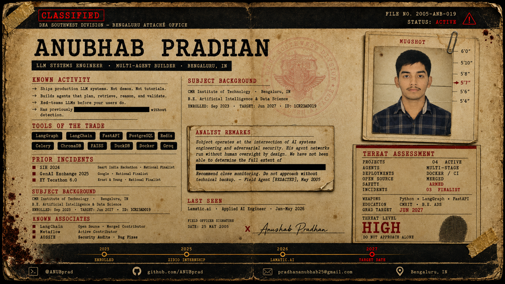

<div align="center">

</div>

```
━━━━━━━━━━━━━━━━━━━━━━━━━━━━━━━━━━━━━━━━━━━━━━━━━━━━━━━━━━━━━━━━━━━━
  SUPPLEMENTARY FIELD NOTES  ·  FILE NO. 2005-ANB-019  ·  PAGE 2
  DEA SOUTHWEST DIVISION — BENGALURU ATTACHÉ OFFICE
  ANALYST COPY  ·  DO NOT DUPLICATE  ·  DESTROY AFTER REVIEW
━━━━━━━━━━━━━━━━━━━━━━━━━━━━━━━━━━━━━━━━━━━━━━━━━━━━━━━━━━━━━━━━━━━━
```

---

### CURRENT STATUS

```
  ┌─────────────────────────────────────────────────────────────────┐
  │  SUBJECT         :  Anubhab Pradhan  ·  @ANUBprad              │
  │  LOCATION        :  Bengaluru, Karnataka, IN                    │
  │  CURRENT COVER   :  B.E. student  ·  CMRIT  ·  Final year      │
  │  REAL OCCUPATION :  Building production LLM systems             │
  │                                                                 │
  │  🔴  ACTIVELY BUILDING   —  New operation in progress          │
  │  🟡  PLACEMENT WINDOW    —  Opens August 2026                  │
  │  🟢  OPEN SOURCE         —  PRs being filed as you read this   │
  │                                                                 │
  │  AVAILABILITY    :  Full-time from June 2027                   │
  │  OPEN TO         :  AI-native startups  ·  FAANG  ·  Research  │
  │  WILL NOT DO     :  Tutorial projects  ·  Demo-only roles      │
  └─────────────────────────────────────────────────────────────────┘
```

---

### ⚠ KNOWN OPERATIONS

| OPERATION | CLASSIFIED BRIEF |
|-----------|-----------------|
| **RedOps** | Autonomous LLM red-teaming network. Six attack vectors. 100+ live payloads. Scores itself. Nobody pulls the trigger twice. |
| **Kairos** | Four-agent orchestration cell. Planner → Retriever → Reasoner → Validator. Self-operating. Running unsupervised since deployment. |
| **APEXiq** | Natural language to SQL pipeline. Agents write queries, validate them, report back. F1 telemetry. Business intelligence. No human in the loop. |
| **DeepDive** | Video intelligence system. Transcribes, chunks, indexes, retrieves. Bilingual. Runs on free APIs. Hours of footage in seconds. |

---

### FIELD ASSIGNMENTS

**Lamatic.ai — Applied AI Engineer** *(Jan – May 2026)*

Built LLM agent pipelines for end-to-end workflow automation. Workflows that required operators stopped requiring them. Subject made himself structurally irreplaceable, then moved on.

**Zidio Development — Data Science Intern** *(Aug – Nov 2025)*

Stacked ARIMA, Prophet, LSTM into single ensemble. Built automated evaluation pipeline. Team inherited a system that worked harder than the people before it.

---

### ARSENAL — CONFIRMED WEAPONS

> *The following instruments were recovered from subject's workstation.*
> *All are operational. All are dangerous in the right hands.*

**Primary Weapons — LLM & Agentic Systems**


**Field Infrastructure — Backend & Production**


**Intelligence Systems — Data & Search**


---

### KNOWN ASSOCIATES

```
  LangChain          Infiltrated core repository · Issue #31802
  Metaflow           Embedded in production ML pipeline work
  AOSSIE             OpenVerifiableLLM · Found critical bugs
```

---

### BACKGROUND

```
  INSTITUTION  :  CMR Institute of Technology, Bengaluru
  PROGRAM      :  B.E. Artificial Intelligence & Data Science
  ENROLLED     :  September 2023
  TARGET DATE  :  June 2027
  FILE ID      :  1CR23AD019
```

---

### ANALYST REMARKS

*Filed by Field Agent [REDACTED] · 25 May 2005*

> "Subject does not wait for problems. He finds gaps, builds tools, ships them. His red-teaming runs in production right now. His agent networks operate without human oversight by design.
>
> We have not been able to determine the full extent of ████████████████████████████████████████████████.
>
> Do not approach without technical backup. Do not underestimate the intern."

---

### REACH THE SUSPECT

<div align="center">

[](mailto:pradhananubhab25@gmail.com)
[](https://www.linkedin.com/in/anubhabpradhan)
[](https://github.com/ANUBprad)
[](https://leetcode.com/ANUBprad)

</div>

---

<div align="center">
<sub><i>"I did it for me. I liked it. I was good at it. And I was really — I was alive."</i></sub>
<br/>
<sub>— Walter White · Breaking Bad · S05E16</sub>
</div>
