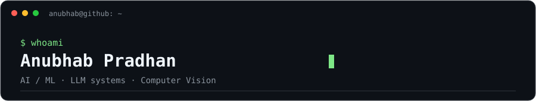
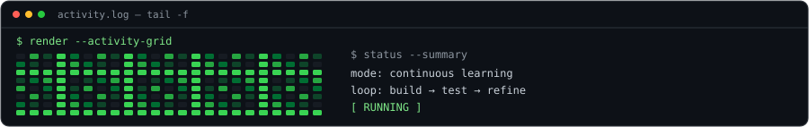

<div align="center">





</div>


## `$ ./activity --watch`

<div align="center">

</div>


## `$ cat ./about.txt`

```console
anubhab@github:~$ whoami
Anubhab Pradhan

anubhab@github:~$ focus --current
AI / ML · LLM systems · Computer Vision · MLOps
```

I'm interested in the part of AI that starts **after the model works**: evaluating systems, connecting them to tools, deploying them, debugging failures, and making them reliable.


## `$ ./currently-exploring`

```console
[01] LLM applications and agentic workflows
[02] RAG and evaluation
[03] Computer vision
[04] ML systems and deployment
[05] Open-source AI tooling
```


## `$ cat ./experience.log`

```console
[INTERNSHIP] Lamatic.ai — Applied AI Intern
  Agentic AI workflows, tool calls, REST/GraphQL integrations,
  and multi-step execution.

[OPEN SOURCE] AI infrastructure and developer tooling
  Contributing to projects including LangChain.

[RESEARCH] ICAC2N 2026
  Applied AI/ML research.
```


## `$ neofetch --stack`

<div align="center">

<a href="https://skillicons.dev">

</a>

<br><br>

<a href="https://skillicons.dev">

</a>

</div>


<div align="center">

```console
anubhab@github:~$ cat /etc/motd
Build -> measure -> break -> understand -> improve.
```

</div>
